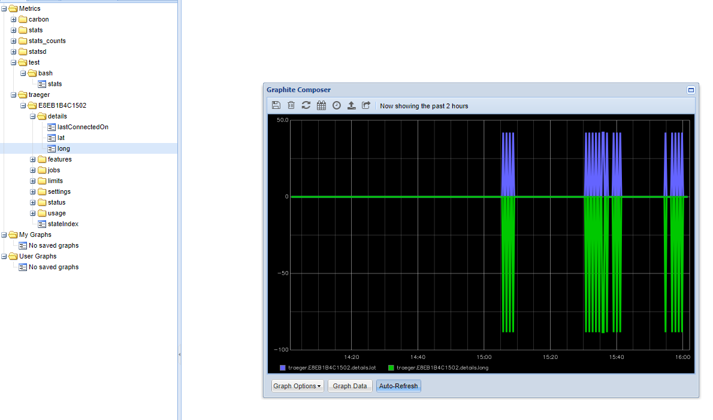

# Traeger Python Library

Create proper documentation here ...

Document all of the code and refactor for reuse and readability ...

# Graphite

[Overview here.](https://graphiteapp.org/#overview)

Getting "metrics" (data) into Graphite [here](https://graphiteapp.org/quick-start-guides/feeding-metrics.html).

Using the "Composer" (web UI) [here](https://graphiteapp.org/quick-start-guides/graphing-metrics.html).

You still don't seem to have any graphable data turning up.  NB -- when you were writing this and last playing with it, the grill was off.  Still, it did seem to be returning a bunch of data (though all zeros?).

## Render API
You can hit the /render API to explore metrics data.  For example, here is the fan usage data sent to Graphite in the past 2 hours:

http://localhost/render?target=traeger.E8EB1B4C1502.usage.fan&format=json&from=-2h&until=now

It seems that all of my values are `null`, so there's something wrong with the way that these metrics are being sent.

Looking further, it seems that there is not data being sent for these intervals, as Graphite won't allow you to store a null value.

NEVER MIND!  It seems that it's working just fine!
