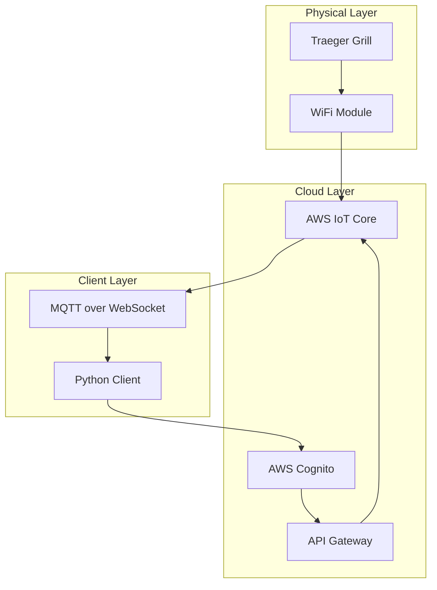

# Traeger Grill Data Streaming Technical Walkthrough

## Table of Contents
1. [Architecture Overview](#architecture-overview)
2. [Initial Setup and Grill Discovery](#initial-setup-and-grill-discovery)
3. [Authentication Flow](#authentication-flow)
4. [WebSocket/MQTT Connection Setup](#websocketmqtt-connection-setup)
5. [Data Flow Architecture](#data-flow-architecture)
6. [Implementation Details](#implementation-details)
7. [Error Handling & Reconnection](#error-handling--reconnection)
8. [Debugging Tips](#debugging-tips)
9. [Common Issues](#common-issues)

## Architecture Overview

The Traeger grill streaming system uses a multi-layered architecture to communicate between the physical grill and client applications:




### Key Components:

1. **AWS Cognito**: Handles user authentication
2. **API Gateway**: RESTful API for commands and grill discovery
3. **AWS IoT Core**: MQTT broker for real-time data streaming
4. **WebSocket Transport**: Enables MQTT communication from web clients

## Initial Setup and Grill Discovery

The initial setup process involves creating a Traeger client instance, authenticating with AWS Cognito, and discovering the user's grills. This section covers the complete flow from username/password to obtaining the grill's unique identifier (thingName).

### Step 1: Client Initialization (`traeger.py`, lines 34-62)

```python
class Traeger:
    def __init__(self, username, password, request_library=requests):
        self.username = username
        self.password = password
        self.mqtt_uuid = str(uuid.uuid1())
        self.mqtt_thread_running = False
        self.mqtt_thread_refreshing = False
        self.grills = []
        self.grill_status = {}
        self.grills_active = False
        self.loop = asyncio.get_event_loop()
        self.task = None
        self.mqtt_url = None
        self.mqtt_client = None
        self.grill_status = {}
        self.access_token = None
        self.token = None
        self.refresh_token_value = None  # Initialize here
        self.token_expires = 0
        self.mqtt_url_expires = time.time()
        self.request = request_library
        if request_library == aiohttp.ClientSession:
            self.session = aiohttp.ClientSession()
        else:
            self.session = None
        self.grill_callbacks = {}
        self.mqtt_client_inloop = False
        self.autodisconnect = False
```

Key initialization parameters:
- `username`: Traeger account email address
- `password`: Traeger account password
- `request_library`: HTTP library to use (requests or aiohttp)

### Step 2: Initial Authentication (`traeger.py`, lines 63-64)

```python
async def initialize(self):
    await self.do_cognito()
```

The `initialize()` method is the entry point that triggers the authentication process.

### Step 3: User Data Retrieval (`traeger.py`, lines 139-149)

```python
async def get_user_data(self):
    await self.refresh_token()
    user_data = await self.api_wrapper(
        "get",
        "https://1ywgyc65d1.execute-api.us-west-2.amazonaws.com/prod/users/self",
        headers={"authorization": self.token},
    )
    if user_data is None:
        _LOGGER.error("Failed to get user data.")
    return user_data
```

This method retrieves the user's profile data, including their registered grills.

### Step 4: Grill Discovery (`traeger.py`, lines 186-198)

```python
async def update_grills(self):
    json_data = await self.get_user_data()
    if json_data and "things" in json_data:
        self.grills = json_data["things"]
    else:
        _LOGGER.error("Failed to get grills: %s", json_data)
        self.grills = []  # Default to an empty list if the response is invalid

async def get_grills(self):
    await self.update_grills()
    return self.grills
```

The grill discovery process:
1. Calls the `/users/self` API endpoint
2. Extracts the `things` array from the response
3. Each "thing" represents a registered grill with its `thingName`

### Example User Data Response:

```json
{
    "userId": "12345-abcde-67890",
    "email": "user@example.com",
    "things": [
        {
            "thingName": "TRAEGER-ABC123XYZ",  // Unique grill identifier
            "friendlyName": "My Traeger Pro 575",
            "model": "D2 WiFIRE",
            "serialNumber": "ABC123XYZ",
            "firmwareVersion": "2.01.00",
            "hardwareVersion": "1.0"
        }
    ],
    "preferences": {
        "temperatureUnits": "fahrenheit",
        "notifications": true
    }
}
```

### Step 5: Complete Setup Flow

Here's a complete example of the setup flow:

```python
# Create client instance
traeger = Traeger(username="user@example.com", password="password123")

# Initialize and authenticate
await traeger.initialize()

# Discover grills
grills = await traeger.get_grills()

# Extract grill identifier
if grills:
    grill_id = grills[0]['thingName']  # e.g., "TRAEGER-ABC123XYZ"
    print(f"Found grill: {grill_id}")
```

### Configuration and Environment Variables

The implementation uses hardcoded values for some configuration:

```python
CLIENT_ID = "2fuohjtqv1e63dckp5v84rau0j"  # AWS Cognito App Client ID
TIMEOUT = 60  # API request timeout in seconds
```

For production use, these should be externalized to environment variables:

```python
import os

CLIENT_ID = os.getenv("TRAEGER_CLIENT_ID", "2fuohjtqv1e63dckp5v84rau0j")
TRAEGER_USERNAME = os.getenv("TRAEGER_USERNAME")
TRAEGER_PASSWORD = os.getenv("TRAEGER_PASSWORD")
```

### Error Handling During Setup

The setup process includes error handling at each step:

1. **Authentication Failure** (`traeger.py`, lines 90-97):
   ```python
   if response and 'AuthenticationResult' in response:
       self.token = response['AuthenticationResult']['IdToken']
       self.refresh_token_value = response['AuthenticationResult'].get('RefreshToken')
       self.token_expires = time.time() + response['AuthenticationResult']['ExpiresIn']
       _LOGGER.info('Initial token obtained successfully.')
   else:
       _LOGGER.error("Failed to authenticate with Cognito: %s", response)
       raise Exception("Initial authentication failed")
   ```

2. **User Data Retrieval Failure** (`traeger.py`, lines 146-148):
   ```python
   if user_data is None:
       _LOGGER.error("Failed to get user data.")
   ```

3. **Grill Discovery Failure** (`traeger.py`, lines 189-192):
   ```python
   if json_data and "things" in json_data:
       self.grills = json_data["things"]
   else:
       _LOGGER.error("Failed to get grills: %s", json_data)
       self.grills = []  # Default to an empty list
   ```

### Modern Implementation Comparison (`traeger_newnew.py`)

The newer implementation (`traeger_newnew.py`) includes some improvements:

1. **Session Management** (`traeger_newnew.py`, lines 46-48):
   ```python
   async def initialize(self):
       self.session = aiohttp.ClientSession()
       await self.do_cognito()
   ```

2. **Enhanced Logging** (`traeger_newnew.py`, line 19):
   ```python
   logging.basicConfig(level=logging.DEBUG, format='%(asctime)s %(name)s %(levelname)s %(message)s')
   ```

3. **WebSocket URL Validation** (`traeger_newnew.py`, lines 385-398):
   ```python
   async def check_websocket_url(self, url):
       async with aiohttp.ClientSession() as session:
           try:
               async with session.get(url) as response:
                   _LOGGER.debug("Checking WebSocket URL: %s", url)
                   if response.status == 200:
                       _LOGGER.debug("WebSocket URL %s is accessible.", url)
                   else:
                       _LOGGER.error("WebSocket URL %s is not accessible. Status: %s", url, response.status)
           except Exception as e:
               _LOGGER.error("Error checking WebSocket URL %s: %s", url, e)
   ```

### Summary

The initial setup and grill discovery process follows this sequence:
1. Create Traeger client with credentials
2. Authenticate with AWS Cognito to get tokens
3. Call `/users/self` API to get user data
4. Extract grill information from the `things` array
5. Use the `thingName` as the unique identifier for all subsequent operations

The `thingName` is critical as it's used for:
- MQTT topic subscriptions: `prod/thing/update/{thingName}`
- Sending commands: `/prod/things/{thingName}/commands`
- Identifying grill status updates in the `grill_status` dictionary

## Authentication Flow

The authentication process involves multiple steps with AWS Cognito:

### Step 1: Initial Authentication (`traeger.py`, lines 69-98)

```python
async def do_cognito(self):
    t = datetime.datetime.utcnow()
    amzdate = t.strftime("%Y%m%dT%H%M%SZ")
    response = await self.api_wrapper(
        "post",
        "https://cognito-idp.us-west-2.amazonaws.com/",
        data={
            "ClientMetadata": {},
            "AuthParameters": {
                "PASSWORD": self.password,
                "USERNAME": self.username,
            },
            "AuthFlow": "USER_PASSWORD_AUTH",
            "ClientId": CLIENT_ID,  # "2fuohjtqv1e63dckp5v84rau0j"
        },
        headers={
            "Content-Type": "application/x-amz-json-1.1",
            "X-Amz-Date": amzdate,
            "X-Amz-Target": "AWSCognitoIdentityProviderService.InitiateAuth",
        },
    )
```

The authentication flow:
1. Client sends username/password to Cognito
2. Cognito validates credentials
3. Returns `IdToken`, `RefreshToken`, and expiration time
4. Token typically expires in 3600 seconds (1 hour)

### Step 2: Token Refresh (`traeger.py`, lines 99-138)

```python
async def refresh_token(self):
    if self.token_remaining() < 60:  # Refresh if less than 60 seconds remaining
        if not self.refresh_token_value:
            _LOGGER.error("Cannot refresh token: REFRESH_TOKEN is missing")
            return

        url = 'https://cognito-idp.us-west-2.amazonaws.com/'
        data = {
            'ClientId': CLIENT_ID,
            'AuthFlow': 'REFRESH_TOKEN_AUTH',
            'AuthParameters': {
                'REFRESH_TOKEN': self.refresh_token_value
            }
        }
```

The refresh mechanism:
- Automatically triggers when token has < 60 seconds remaining
- Uses the refresh token from initial auth
- Updates both `IdToken` and potentially `RefreshToken`

## WebSocket/MQTT Connection Setup

### Step 1: Get MQTT URL (`traeger.py`, lines 210-235)

```python
async def refresh_mqtt_url(self):
    await self.refresh_token()
    if self.mqtt_url_remaining() < 60:
        mqtt_request_time = time.time()
        json = await self.api_wrapper(
            "post",
            "https://1ywgyc65d1.execute-api.us-west-2.amazonaws.com/prod/mqtt-connections",
            headers={"Authorization": self.token},
        )
        self.mqtt_url_expires = json["expirationSeconds"] + mqtt_request_time
        self.mqtt_url = json["signedUrl"]
```

The MQTT URL:
- Is a pre-signed WebSocket URL for AWS IoT
- Expires after a certain time (usually 24 hours)
- Contains authentication credentials in the query string

### Step 2: Configure MQTT Client (`traeger.py`, lines 314-376)

```python
async def get_mqtt_client(self):
    # Create MQTT client with WebSocket transport
    self.mqtt_client = mqtt.Client(transport="websockets")
    
    # Set up callbacks
    self.mqtt_client.on_connect = self.mqtt_onconnect
    self.mqtt_client.on_message = self.mqtt_onmessage
    
    # Configure TLS
    context = ssl.SSLContext(ssl.PROTOCOL_TLS_CLIENT)
    context.check_hostname = True
    context.verify_mode = ssl.CERT_REQUIRED
    context.load_default_certs()
    self.mqtt_client.tls_set_context(context)
    
    # Parse WebSocket URL and set options
    mqtt_parts = urllib.parse.urlparse(self.mqtt_url)
    headers = {"Host": mqtt_parts.netloc}
    path = "{}?{}".format(mqtt_parts.path, mqtt_parts.query)
    self.mqtt_client.ws_set_options(path=path, headers=headers)
    
    # Connect with retry logic
    self.mqtt_client.connect(mqtt_parts.netloc, 443, keepalive=300)
```

### Step 3: Subscribe to Topics (`traeger.py`, lines 379-384)

```python
def mqtt_onconnect(self, client, userdata, flags, rc):
    _LOGGER.info("Connected with result code %s", rc)
    for grill in self.grills:
        topic = f"prod/thing/update/{grill['thingName']}"
        client.subscribe((topic, 1))
```

MQTT Topics:
- Each grill has a unique `thingName` identifier
- Topic format: `prod/thing/update/{thingName}`
- QoS level 1 ensures at-least-once delivery

## Data Flow Architecture

### Grill to Cloud Flow:

```
1. Grill Controller → WiFi Module → AWS IoT Core
   - Grill sends status updates periodically
   - Uses MQTT publish to its thing topic
   
2. AWS IoT Core → Topic Subscribers
   - Messages are routed to all subscribers
   - Includes our Python client via WebSocket
```

### Cloud to Client Flow:

```python
# Message handling (traeger.py, lines 401-425)
def mqtt_onmessage(self, client, userdata, message):
    if message.topic.startswith("prod/thing/update/"):
        grill_id = message.topic[len("prod/thing/update/") :]
        self.grill_status[grill_id] = json.loads(message.payload)
        
        # Trigger callbacks for UI updates
        if grill_id in self.grill_callbacks:
            for callback in self.grill_callbacks[grill_id]:
                callback()
```

### Example Status Message:

```json
{
    "thingName": "GRILL_ID_HERE",
    "status": {
        "connected": true,
        "grill": 225,           // Current grill temperature
        "set": 250,             // Set temperature
        "ambient": 72,          // Ambient temperature
        "system_status": 5,     // 5 = SMOKING state
        "fan_speed": 3,
        "pellet_level": 75,
        "units": 1,             // 1 = Fahrenheit
        "acc": [                // Accessories (probes)
            {
                "uuid": "probe1",
                "type": "probe",
                "temperature": 165,
                "alarm_set": 165,
                "alarm_fired": true,
                "connected": true
            }
        ]
    }
}
```

## Implementation Details

### Command Sending (`traeger.py`, lines 151-167)

```python
async def send_command(self, thingName, command):
    await self.refresh_token()
    await self.api_wrapper(
        "post_raw",
        f"https://1ywgyc65d1.execute-api.us-west-2.amazonaws.com/prod/things/{thingName}/commands",
        data={"command": command},
        headers={
            "Authorization": self.token,
            "Content-Type": "application/json",
            "Accept-Language": "en-us",
            "User-Agent": "Traeger/11 CFNetwork/1209 Darwin/20.2.0",
        },
    )
```

Command Protocol:
- Commands are sent via REST API, not MQTT
- Common commands:
  - `"90"` - Request status update
  - `"11,{temp}"` - Set grill temperature
  - `"14,{temp}"` - Set probe temperature
  - `"17"` - Shutdown grill

### Thread Management (`traeger.py`, lines 220-252)

```python
def _mqtt_connect_func(self):
    """Runs in separate thread to handle MQTT loop"""
    loop = asyncio.new_event_loop()
    asyncio.set_event_loop(loop)
    while self.mqtt_thread_running:
        self.mqtt_client_inloop = True
        self.mqtt_client.loop_forever()  # Blocking call
        self.mqtt_client_inloop = False
        
        # Wait if URL needs refresh
        while (self.mqtt_url_remaining() < 60 or self.mqtt_thread_refreshing) and self.mqtt_thread_running:
            time.sleep(1)
```

The implementation uses a dedicated thread for MQTT to avoid blocking the main async loop.

### Modern Streaming Implementation (`traeger-stream/`)

The newer implementation in `traeger-stream/` provides cleaner abstractions:

```python
# traeger_client/client.py, lines 51-65
async def connect(self):
    """Connect to Traeger services."""
    self.session = aiohttp.ClientSession()
    await self._authenticate()
    await self._discover_grills()
    await self._connect_mqtt()
```

Key improvements:
- Uses pydantic models for type safety
- Cleaner separation of concerns
- Built-in streaming buffer for time-series data

## Error Handling & Reconnection

### WebSocket Handshake Issues (`traeger_newnew.py`, lines 385-398)

```python
async def check_websocket_url(self, url):
    """Validates WebSocket URL accessibility"""
    async with aiohttp.ClientSession() as session:
        try:
            async with session.get(url) as response:
                if response.status == 200:
                    _LOGGER.debug("WebSocket URL %s is accessible.", url)
                else:
                    _LOGGER.error("WebSocket URL %s is not accessible. Status: %s", url, response.status)
        except Exception as e:
            _LOGGER.error("Error checking WebSocket URL %s: %s", url, e)
```

### Reconnection Strategy (`traeger.py`, lines 356-369)

```python
retry_attempts = 0
while retry_attempts < 5:
    try:
        self.mqtt_client.connect(mqtt_parts.netloc, 443, keepalive=300)
        break
    except Exception as e:
        retry_attempts += 1
        _LOGGER.error(f"Connection Failed: {e}, retrying in {2 ** retry_attempts} seconds...")
        await asyncio.sleep(2 ** retry_attempts)  # Exponential backoff
```

### Connection Monitoring (`traeger.py`, lines 467-484)

```python
async def main(self):
    """Main loop that monitors and refreshes connections"""
    if self.mqtt_url_remaining() < 60:
        self.mqtt_thread_refreshing = True
        if self.mqtt_thread_running:
            self.mqtt_client.disconnect()
            self.mqtt_client = None
        await self.get_mqtt_client()
        self.mqtt_thread_refreshing = False
```

## Debugging Tips

### 1. Enable Debug Logging

```python
# traeger_newnew.py, line 19
logging.basicConfig(level=logging.DEBUG, format='%(asctime)s %(name)s %(levelname)s %(message)s')
```

### 2. Monitor Key Timeouts

```python
_LOGGER.info(
    f"Token Time Remaining:{self.token_remaining()} "
    f"MQTT Time Remaining:{self.mqtt_url_remaining()}"
)
```

### 3. Check WebSocket URL Format

The WebSocket URL should look like:
```
wss://abcdefghij.iot.us-west-2.amazonaws.com/mqtt?X-Amz-Algorithm=...
```

### 4. Verify TLS Configuration

```python
# Enable socket-level debugging
self.mqtt_client.on_socket_open = self.mqtt_onsocketopen
self.mqtt_client.on_socket_close = self.mqtt_onsocketclose
```

### 5. Monitor MQTT Callbacks

All MQTT events have dedicated callbacks for debugging:
- `on_connect` - Connection established
- `on_disconnect` - Connection lost
- `on_message` - Message received
- `on_subscribe` - Subscription confirmed

## Common Issues

### 1. WebSocket Handshake Failures

**Symptoms**: 
- "WebSocket handshake error"
- Connection timeouts

**Common Causes**:
- Expired MQTT URL
- Incorrect WebSocket headers
- TLS version mismatch

**Solution**:
```python
# Force URL refresh
self.mqtt_url_expires = time.time()
await self.refresh_mqtt_url()
```

### 2. Token Expiration During Long Cook

**Symptoms**:
- Connection drops after ~1 hour
- 401 Unauthorized errors

**Solution**:
The code automatically refreshes tokens before expiration:
```python
if self.token_remaining() < 60:  # 60-second buffer
    await self.refresh_token()
```

### 3. Missing Grill Updates

**Symptoms**:
- No status updates received
- Stale temperature readings

**Solutions**:
1. Send manual update request:
   ```python
   await self.send_command(thingName, "90")
   ```
2. Check subscription status in `mqtt_onsubscribe`
3. Verify grill is connected to WiFi

### 4. Thread Synchronization Issues

**Symptoms**:
- Deadlocks
- Asyncio warnings

**Solution**:
The code uses separate event loops for threads:
```python
# In thread function
loop = asyncio.new_event_loop()
asyncio.set_event_loop(loop)
```

### 5. Memory Leaks in Long-Running Sessions

**Symptoms**:
- Increasing memory usage
- Performance degradation

**Solutions**:
1. Implement circular buffer for status history
2. Clear old callbacks:
   ```python
   self.grill_callbacks[grill_id].clear()
   ```
3. Properly close sessions:
   ```python
   await self.session.close()
   ```

## Best Practices

1. **Always check token expiration** before API calls
2. **Use exponential backoff** for reconnection attempts
3. **Implement proper cleanup** in shutdown procedures
4. **Monitor both token and MQTT URL** expiration times
5. **Handle partial message delivery** - messages may be fragmented
6. **Validate all data** before processing - grills may send malformed data
7. **Use callbacks sparingly** - they run in the MQTT thread context

## Conclusion

The Traeger streaming system is a complex integration of AWS services, WebSocket transport, and MQTT messaging. Understanding the authentication flow, connection lifecycle, and error handling patterns is crucial for maintaining a stable connection to the grill. The newer `traeger-stream` implementation provides a cleaner architecture that's easier to debug and extend.