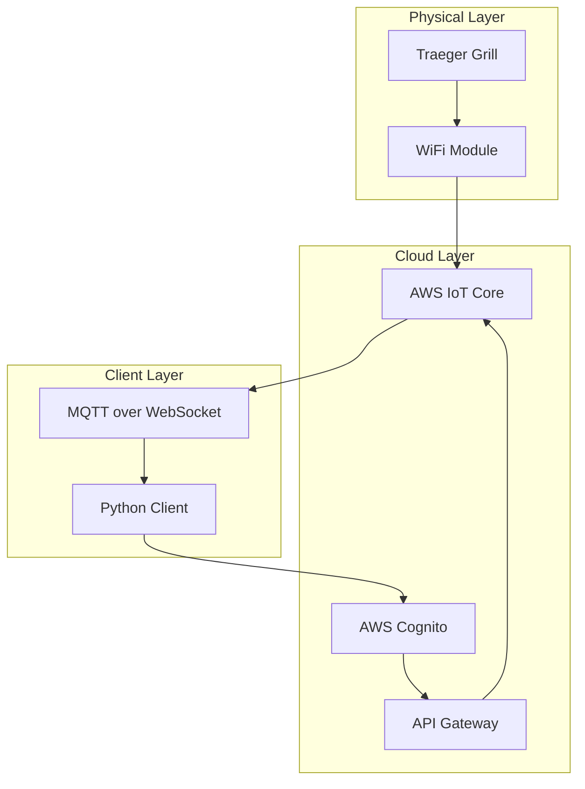

# Traeger Grill Data Streaming Technical Walkthrough

## Table of Contents
1. [Architecture Overview](#architecture-overview)
2. [Initial Setup and Grill Discovery](#initial-setup-and-grill-discovery)
3. [Authentication Flow](#authentication-flow)
4. [WebSocket/MQTT Connection Setup](#websocketmqtt-connection-setup)
5. [Data Flow Architecture](#data-flow-architecture)
6. [Implementation Details](#implementation-details)
7. [Error Handling & Reconnection](#error-handling--reconnection)
8. [Debugging Tips](#debugging-tips)
9. [Common Issues](#common-issues)

## Architecture Overview

The Traeger grill streaming system uses a multi-layered architecture to communicate between the physical grill and client applications:




### Key Components:

1. **AWS Cognito**: Handles user authentication
2. **API Gateway**: RESTful API for commands and grill discovery
3. **AWS IoT Core**: MQTT broker for real-time data streaming
4. **WebSocket Transport**: Enables MQTT communication from web clients

## Initial Setup and Grill Discovery

The initial setup process involves creating a Traeger client instance, authenticating with AWS Cognito, and discovering the user's grills. This section covers the complete flow from username/password to obtaining the grill's unique identifier (thingName).

### Step 1: Client Initialization (`traeger_client/client.py`, lines 23-51)

```python
class TraegerClient:
    """Clean async client for Traeger grills."""
    
    def __init__(self, username: str, password: str):
        self.username = username
        self.password = password
        
        # Authentication
        self.token: Optional[str] = None
        self.refresh_token: Optional[str] = None
        self.token_expires = 0
        
        # MQTT
        self.mqtt_url: Optional[str] = None
        self.mqtt_url_expires = 0
        self.mqtt_client: Optional[mqtt.Client] = None
        self._mqtt_connected = False
        self.mqtt_thread_refreshing = False
        
        # Session
        self.session: Optional[aiohttp.ClientSession] = None
        
        # Grills
        self.grills: List[Dict[str, Any]] = []
        self._grill_status: Dict[str, GrillStatus] = {}
        
        # Callbacks
        self._status_callbacks: List[Callable[[GrillStatus], None]] = []
```

Key initialization parameters:
- `username`: Traeger account email address
- `password`: Traeger account password
- Clean async implementation with type hints

### Step 2: Initial Authentication (`traeger_client/client.py`, lines 52-58)

```python
async def connect(self):
    """Connect to Traeger services."""
    self.session = aiohttp.ClientSession()
    await self._authenticate()
    await self._discover_grills()
    await self._connect_mqtt()
```

The `connect()` method is the entry point that:
1. Creates an aiohttp session
2. Authenticates with AWS Cognito
3. Discovers available grills
4. Establishes MQTT connection

### Step 3: User Data Retrieval (`traeger_client/client.py`, lines 128-140)

```python
async def _discover_grills(self):
    """Discover available grills."""
    await self._refresh_auth()
    
    headers = {"authorization": self.token}
    async with self.session.get(
        "https://1ywgyc65d1.execute-api.us-west-2.amazonaws.com/prod/users/self",
        headers=headers
    ) as resp:
        data = await resp.json(content_type=None)
        
    self.grills = data.get("things", [])
    logger.info(f"Discovered {len(self.grills)} grills")
```

This method retrieves the user's profile data, including their registered grills.

### Step 4: Grill Discovery (`traeger_client/client.py`, lines 313-321)

```python
def list_grills(self) -> List[Dict[str, str]]:
    """List available grills."""
    return [
        {
            "thing_name": g["thingName"],
            "friendly_name": g.get("friendlyName", g["thingName"])
        }
        for g in self.grills
    ]
```

The grill discovery process:
1. Calls the `/users/self` API endpoint in `_discover_grills()`
2. Extracts the `things` array from the response
3. Each "thing" represents a registered grill with its `thingName`
4. Returns a simplified list with thing_name and friendly_name

### Example User Data Response:

```json
{
    "userId": "12345-abcde-67890",
    "email": "user@example.com",
    "things": [
        {
            "thingName": "TRAEGER-ABC123XYZ",  // Unique grill identifier
            "friendlyName": "My Traeger Pro 575",
            "model": "D2 WiFIRE",
            "serialNumber": "ABC123XYZ",
            "firmwareVersion": "2.01.00",
            "hardwareVersion": "1.0"
        }
    ],
    "preferences": {
        "temperatureUnits": "fahrenheit",
        "notifications": true
    }
}
```

### Step 5: Complete Setup Flow

Here's a complete example of the setup flow (`examples/simple_monitor.py`, lines 22-49):

```python
# Create client instance
client = TraegerClient(username, password)

# Connect (authenticate, discover grills, connect MQTT)
await client.connect()

# List grills
grills = client.list_grills()
print(f"\nFound {len(grills)} grills:")
for grill in grills:
    print(f"  - {grill['friendly_name']} ({grill['thing_name']})")
```

### Configuration and Environment Variables

The implementation uses hardcoded values for some configuration:

```python
CLIENT_ID = "2fuohjtqv1e63dckp5v84rau0j"  # AWS Cognito App Client ID (client.py, line 19)
TIMEOUT = 60  # API request timeout in seconds (client.py, line 20)
```

For production use, these should be externalized to environment variables:

```python
import os

CLIENT_ID = os.getenv("TRAEGER_CLIENT_ID", "2fuohjtqv1e63dckp5v84rau0j")
TRAEGER_USERNAME = os.getenv("TRAEGER_USERNAME")
TRAEGER_PASSWORD = os.getenv("TRAEGER_PASSWORD")
```

### Error Handling During Setup

The setup process includes error handling at each step:

1. **Authentication Failure** (`traeger_client/client.py`, lines 90-97):
   ```python
   if "AuthenticationResult" in result:
       auth = result["AuthenticationResult"]
       self.token = auth["IdToken"]
       self.refresh_token = auth.get("RefreshToken")
       self.token_expires = time.time() + auth["ExpiresIn"]
       logger.info("Authentication successful")
   else:
       raise Exception(f"Authentication failed: {result}")
   ```

2. **MQTT Connection Timeout** (`traeger_client/client.py`, lines 184-190):
   ```python
   # Wait for connection
   for _ in range(10):
       if self._mqtt_connected:
           break
       await asyncio.sleep(1)
   else:
       raise Exception("MQTT connection timeout")
   ```

3. **Grill Discovery** (`traeger_client/client.py`, lines 139-140):
   ```python
   self.grills = data.get("things", [])
   logger.info(f"Discovered {len(self.grills)} grills")
   ```

### Modern Implementation Features

The current implementation in `traeger-stream/traeger_client/` includes these features:

1. **Type Safety with Pydantic Models** (`models.py`, lines 35-80):
   ```python
   class GrillStatus(BaseModel):
       """Complete grill status data."""
       thing_name: str
       friendly_name: str
       connected: bool = False
       state: GrillState = GrillState.OFFLINE
       # ... additional fields
   ```

2. **Clean Command Interface** (`models.py`, lines 82-110):
   ```python
   class GrillCommand(BaseModel):
       """Commands that can be sent to the grill."""
       thing_name: str
       command: str
       
       @classmethod
       def set_temperature(cls, thing_name: str, temp: int) -> "GrillCommand":
           """Create command to set grill temperature."""
           return cls(thing_name=thing_name, command=f"11,{temp}")
   ```

3. **Callback-based Status Updates** (`client.py`, lines 280-287):
   ```python
   def add_status_callback(self, callback: Callable[[GrillStatus], None]):
       """Add callback for status updates."""
       self._status_callbacks.append(callback)
   ```

### Summary

The initial setup and grill discovery process follows this sequence:
1. Create Traeger client with credentials
2. Authenticate with AWS Cognito to get tokens
3. Call `/users/self` API to get user data
4. Extract grill information from the `things` array
5. Use the `thingName` as the unique identifier for all subsequent operations

The `thingName` is critical as it's used for:
- MQTT topic subscriptions: `prod/thing/update/{thingName}`
- Sending commands: `/prod/things/{thingName}/commands`
- Identifying grill status updates in the `grill_status` dictionary

## Authentication Flow

The authentication process involves multiple steps with AWS Cognito:

### Step 1: Initial Authentication (`traeger_client/client.py`, lines 67-97)

```python
async def _authenticate(self):
    """Authenticate with AWS Cognito."""
    data = {
        "ClientMetadata": {},
        "AuthParameters": {
            "PASSWORD": self.password,
            "USERNAME": self.username,
        },
        "AuthFlow": "USER_PASSWORD_AUTH",
        "ClientId": CLIENT_ID,
    }
    headers = {
        "Content-Type": "application/x-amz-json-1.1",
        "X-Amz-Target": "AWSCognitoIdentityProviderService.InitiateAuth",
    }
    
    async with self.session.post(
        "https://cognito-idp.us-west-2.amazonaws.com/",
        json=data,
        headers=headers
    ) as resp:
        result = await resp.json(content_type=None)
```

The authentication flow:
1. Client sends username/password to Cognito
2. Cognito validates credentials
3. Returns `IdToken`, `RefreshToken`, and expiration time
4. Token typically expires in 3600 seconds (1 hour)

### Step 2: Token Refresh (`traeger_client/client.py`, lines 99-127)

```python
async def _refresh_auth(self):
    """Refresh authentication token if needed."""
    if time.time() > self.token_expires - 60:
        data = {
            "ClientId": CLIENT_ID,
            "AuthFlow": "REFRESH_TOKEN_AUTH",
            "AuthParameters": {
                "REFRESH_TOKEN": self.refresh_token
            }
        }
        headers = {
            "Content-Type": "application/x-amz-json-1.1",
            "X-Amz-Target": "AWSCognitoIdentityProviderService.InitiateAuth"
        }
        
        async with self.session.post(
            "https://cognito-idp.us-west-2.amazonaws.com/",
            json=data,
            headers=headers
        ) as resp:
            result = await resp.json(content_type=None)
```

The refresh mechanism:
- Automatically triggers when token has < 60 seconds remaining
- Uses the refresh token from initial auth
- Updates both `IdToken` and potentially `RefreshToken`

## WebSocket/MQTT Connection Setup

### Step 1: Get MQTT URL (`traeger_client/client.py`, lines 142-157)

```python
async def _get_mqtt_url(self):
    """Get MQTT WebSocket URL."""
    if time.time() > self.mqtt_url_expires - 60:
        await self._refresh_auth()
        
        headers = {"Authorization": self.token}
        async with self.session.post(
            "https://1ywgyc65d1.execute-api.us-west-2.amazonaws.com/prod/mqtt-connections",
            headers=headers
        ) as resp:
            data = await resp.json(content_type=None)
            
        self.mqtt_url = data["signedUrl"]
        self.mqtt_url_expires = data["expirationSeconds"] + time.time()
        logger.info("MQTT URL refreshed")
```

The MQTT URL:
- Is a pre-signed WebSocket URL for AWS IoT
- Expires after a certain time (usually 24 hours)
- Contains authentication credentials in the query string

### Step 2: Configure MQTT Client (`traeger_client/client.py`, lines 158-190)

```python
async def _connect_mqtt(self):
    """Connect to MQTT broker."""
    await self._get_mqtt_url()
    
    self.mqtt_client = mqtt.Client(transport="websockets")
    self.mqtt_client.on_connect = self._on_mqtt_connect
    self.mqtt_client.on_message = self._on_mqtt_message
    self.mqtt_client.on_disconnect = self._on_mqtt_disconnect
    
    # Configure TLS
    context = ssl.SSLContext(ssl.PROTOCOL_TLS_CLIENT)
    context.check_hostname = True
    context.verify_mode = ssl.CERT_REQUIRED
    context.load_default_certs()
    self.mqtt_client.tls_set_context(context)
    
    # Parse WebSocket URL
    parts = urlparse(self.mqtt_url)
    headers = {"Host": parts.netloc}
    path = f"{parts.path}?{parts.query}"
    self.mqtt_client.ws_set_options(path=path, headers=headers)
    
    # Connect
    self.mqtt_client.connect(parts.netloc, 443, keepalive=300)
    self.mqtt_client.loop_start()
```

### Step 3: Subscribe to Topics (`traeger_client/client.py`, lines 192-201)

```python
def _on_mqtt_connect(self, client, userdata, flags, rc):
    """Handle MQTT connection."""
    logger.info(f"MQTT connected: {rc}")
    self._mqtt_connected = True
    
    # Subscribe to all grills
    for grill in self.grills:
        topic = f"prod/thing/update/{grill['thingName']}"
        client.subscribe(topic)
```

MQTT Topics:
- Each grill has a unique `thingName` identifier
- Topic format: `prod/thing/update/{thingName}`
- QoS level 1 ensures at-least-once delivery

## Data Flow Architecture

### Grill to Cloud Flow:

```
1. Grill Controller → WiFi Module → AWS IoT Core
   - Grill sends status updates periodically
   - Uses MQTT publish to its thing topic
   
2. AWS IoT Core → Topic Subscribers
   - Messages are routed to all subscribers
   - Includes our Python client via WebSocket
```

### Cloud to Client Flow:

```python
# Message handling (traeger_client/client.py, lines 207-224)
def _on_mqtt_message(self, client, userdata, message):
    """Handle MQTT messages."""
    try:
        # Parse grill ID from topic
        grill_id = message.topic.split("/")[-1]
        data = json.loads(message.payload)
        
        # Convert to GrillStatus
        status = self._parse_status(grill_id, data)
        self._grill_status[grill_id] = status
        
        # Notify callbacks
        for callback in self._status_callbacks:
            callback(status)
            
    except Exception as e:
        logger.error(f"Error processing message: {e}")
```

### Example Status Message:

```json
{
    "thingName": "GRILL_ID_HERE",
    "status": {
        "connected": true,
        "grill": 225,           // Current grill temperature
        "set": 250,             // Set temperature
        "ambient": 72,          // Ambient temperature
        "system_status": 5,     // 5 = SMOKING state
        "fan_speed": 3,
        "pellet_level": 75,
        "units": 1,             // 1 = Fahrenheit
        "acc": [                // Accessories (probes)
            {
                "uuid": "probe1",
                "type": "probe",
                "temperature": 165,
                "alarm_set": 165,
                "alarm_fired": true,
                "connected": true
            }
        ]
    }
}
```

## Implementation Details

### Command Sending (`traeger_client/client.py`, lines 289-304)

```python
async def send_command(self, command: GrillCommand):
    """Send command to grill."""
    await self._refresh_auth()
    
    url = f"https://1ywgyc65d1.execute-api.us-west-2.amazonaws.com/prod/things/{command.thing_name}/commands"
    headers = {
        "Authorization": self.token,
        "Content-Type": "application/json",
    }
    data = {"command": command.command}
    
    async with self.session.post(url, headers=headers, json=data) as resp:
        if resp.status != 200:
            text = await resp.text()
            raise Exception(f"Command failed: {resp.status} - {text}")
```

Command Protocol:
- Commands are sent via REST API, not MQTT
- Common commands:
  - `"90"` - Request status update
  - `"11,{temp}"` - Set grill temperature
  - `"14,{temp}"` - Set probe temperature
  - `"17"` - Shutdown grill

### MQTT Loop Management (`traeger_client/client.py`, line 182)

```python
self.mqtt_client.loop_start()
```

The modern implementation uses the paho-mqtt library's built-in `loop_start()` method which:
- Automatically handles the MQTT event loop in a background thread
- Simplifies the code significantly
- Avoids manual thread management complexities

### Status Parsing Implementation (`traeger_client/client.py`, lines 225-278)

The implementation includes detailed status parsing:

```python
def _parse_status(self, thing_name: str, data: Dict[str, Any]) -> GrillStatus:
    """Parse raw status data into GrillStatus model."""
    status_data = data.get("status", {})
    
    # Map state
    state_map = {
        0: GrillState.OFFLINE,
        1: GrillState.IDLE,
        2: GrillState.STARTUP,
        3: GrillState.PREHEATING,
        4: GrillState.IGNITING,
        5: GrillState.SMOKING,
        6: GrillState.GRILLING,
        7: GrillState.COOLING,
        8: GrillState.SHUTDOWN,
    }
    state = state_map.get(status_data.get("system_status", 0), GrillState.ERROR)
```

Key features:
- Strongly typed data models
- Comprehensive state mapping
- Support for multiple temperature probes

## Error Handling & Reconnection

### Connection Monitoring (`traeger_client/client.py`, lines 184-190)

```python
# Wait for connection
for _ in range(10):
    if self._mqtt_connected:
        break
    await asyncio.sleep(1)
else:
    raise Exception("MQTT connection timeout")
```

The implementation includes a timeout mechanism for MQTT connection establishment.

### Disconnection Handling (`traeger_client/client.py`, lines 202-206)

```python
def _on_mqtt_disconnect(self, client, userdata, rc):
    """Handle MQTT disconnection."""
    logger.warning(f"MQTT disconnected: {rc}")
    self._mqtt_connected = False
```

The paho-mqtt library handles automatic reconnection internally when using `loop_start()`.

### Clean Disconnect (`traeger_client/client.py`, lines 59-65)

```python
async def disconnect(self):
    """Disconnect from services."""
    if self.mqtt_client:
        self.mqtt_client.loop_stop()
        self.mqtt_client.disconnect()
    if self.session:
        await self.session.close()
```

## Debugging Tips

### 1. Enable Debug Logging

```python
# In your main script
import logging
logging.basicConfig(level=logging.DEBUG)

# Or specifically for the client
logger = logging.getLogger('traeger_client.client')
logger.setLevel(logging.DEBUG)
```

### 2. Use the Example Monitor

The `examples/simple_monitor.py` provides a complete working example:

```python
# Define callback for status updates
def on_status_update(status):
    print(f"\n[{datetime.now().strftime('%H:%M:%S')}] {status.friendly_name}")
    print(f"  State: {status.state.name}")
    print(f"  Grill: {status.grill_temperature}°F (set: {status.grill_set_temperature}°F)")
```

### 3. Check WebSocket URL Format

The WebSocket URL should look like:
```
wss://abcdefghij.iot.us-west-2.amazonaws.com/mqtt?X-Amz-Algorithm=...
```

### 4. Verify TLS Configuration

```python
# Enable socket-level debugging
self.mqtt_client.on_socket_open = self.mqtt_onsocketopen
self.mqtt_client.on_socket_close = self.mqtt_onsocketclose
```

### 5. Monitor MQTT Callbacks

All MQTT events have dedicated callbacks for debugging:
- `on_connect` - Connection established
- `on_disconnect` - Connection lost
- `on_message` - Message received
- `on_subscribe` - Subscription confirmed

## Common Issues

### 1. WebSocket Handshake Failures

**Symptoms**: 
- "WebSocket handshake error"
- Connection timeouts

**Common Causes**:
- Expired MQTT URL
- Incorrect WebSocket headers
- TLS version mismatch

**Solution**:
```python
# Force URL refresh
self.mqtt_url_expires = time.time()
await self.refresh_mqtt_url()
```

### 2. Token Expiration During Long Cook

**Symptoms**:
- Connection drops after ~1 hour
- 401 Unauthorized errors

**Solution**:
The code automatically refreshes tokens before expiration:
```python
if self.token_remaining() < 60:  # 60-second buffer
    await self.refresh_token()
```

### 3. Missing Grill Updates

**Symptoms**:
- No status updates received
- Stale temperature readings

**Solutions**:
1. Send manual update request:
   ```python
   await self.send_command(thingName, "90")
   ```
2. Check subscription status in `mqtt_onsubscribe`
3. Verify grill is connected to WiFi

### 4. Thread Synchronization Issues

**Symptoms**:
- Deadlocks
- Asyncio warnings

**Solution**:
The code uses separate event loops for threads:
```python
# In thread function
loop = asyncio.new_event_loop()
asyncio.set_event_loop(loop)
```

### 5. Memory Leaks in Long-Running Sessions

**Symptoms**:
- Increasing memory usage
- Performance degradation

**Solutions**:
1. Implement circular buffer for status history
2. Clear old callbacks:
   ```python
   self.grill_callbacks[grill_id].clear()
   ```
3. Properly close sessions:
   ```python
   await self.session.close()
   ```

## Best Practices

1. **Always check token expiration** before API calls
2. **Use exponential backoff** for reconnection attempts
3. **Implement proper cleanup** in shutdown procedures
4. **Monitor both token and MQTT URL** expiration times
5. **Handle partial message delivery** - messages may be fragmented
6. **Validate all data** before processing - grills may send malformed data
7. **Use callbacks sparingly** - they run in the MQTT thread context

## Conclusion

The Traeger streaming system is a complex integration of AWS services, WebSocket transport, and MQTT messaging. The current implementation in `traeger-stream/traeger_client/` provides:

- Clean async/await patterns throughout
- Type-safe data models using Pydantic
- Simplified connection management
- Callback-based status updates
- Comprehensive error handling

This architecture makes it easy to integrate with other systems while maintaining a stable connection to the grill.